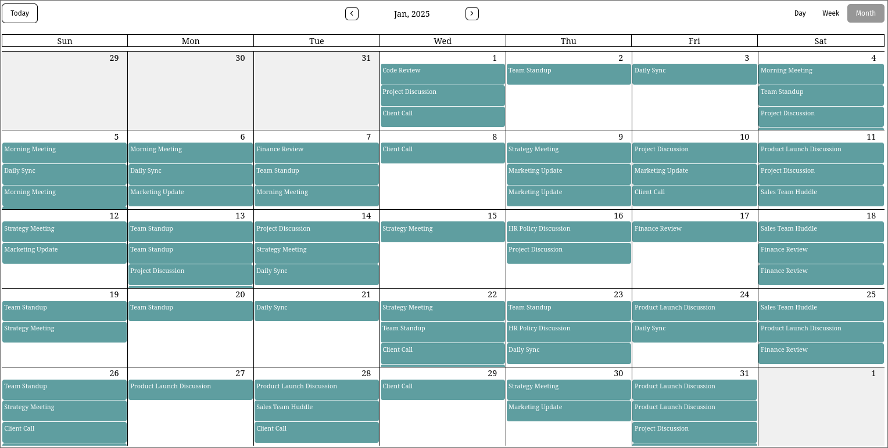
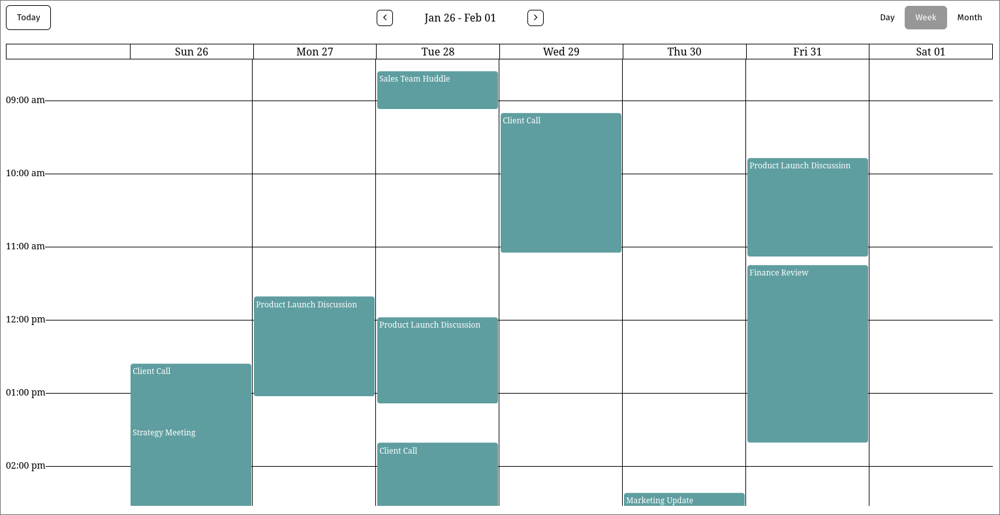
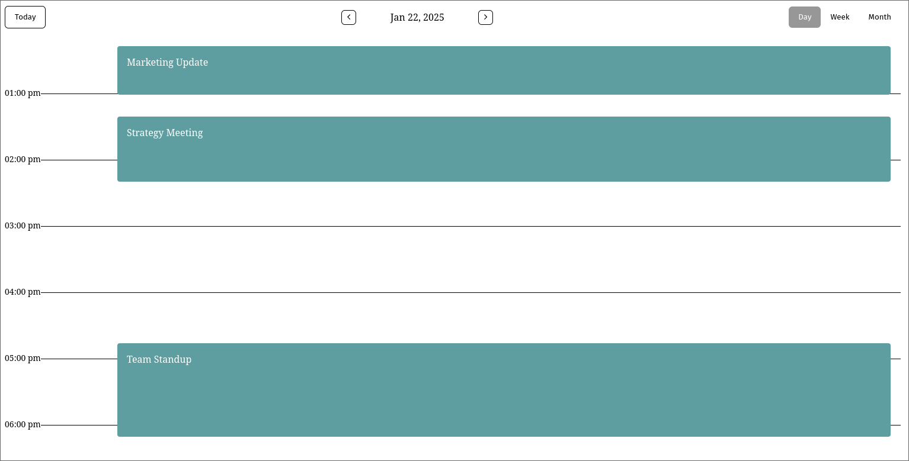

# Calendar Canvas

 
 

A highly customizable and lightweight calendar library to render your events. This library offers an easy way to create interactive and customizable calendar components for your React applications.

## Screenshots

- Month View
  
- Week View
  
- Day View
  

## Installation

To install the `calendar-canvas` library, run the following command:

```bash
npm install calendar-canvas
```

or if you are using yarn:

```bash
yarn add calendar-canvas
```

## Usage

Here's how you can use the `calendar-canvas` component in your project:

### Example

```tsx
"use client";
import {
  CalendarCanvas,
  CalendarContent,
  CalendarContentHeader,
  CalendarContentWrapper,
  CalendarHeader,
} from "calendar-canvas";
import "calendar-canvas/dist/main.css";
import { events } from "../events";

function App() {
  return (
    <CalendarCanvas events={events} defaultView="month">
      <CalendarHeader />
      <CalendarContentWrapper>
        <CalendarContentHeader />
        <CalendarContent />
      </CalendarContentWrapper>
    </CalendarCanvas>
  );
}

export default App;
```

### Props

The `CalendarCanvas` component accepts the following props:

| Prop          | Type                         | Default Value | Description                                          |
| ------------- | ---------------------------- | ------------- | ---------------------------------------------------- |
| `defaultDate` | `Date`                       | `new Date()`  | Sets the default date to display in the calendar.    |
| `defaultView` | `CalendarCanvasViewUnion`    | `'month'`     | Specifies the default view of the calendar.          |
| `events`      | `Array<CalendarCanvasEvent>` | `[]`          | An array of events to be displayed on the calendar.  |
| `className`   | `string`                     | `undefined`   | Optional CSS class to apply to the calendar wrapper. |

## Development

To run the development build, use the following command:

```bash
npm run build
```

This will generate the production-ready files in the `dist/` folder. The library will be available as both CommonJS (`dist/index.js`) and ES Modules (`dist/index.mjs`).

## Contributing

We welcome contributions! If you find any issues or have suggestions for improvements, feel free to create a pull request or open an issue in the repository.

## License

This project is licensed under the MIT License - see the [LICENSE](LICENSE) file for details.

## Author

Abhishek Prajapati [ap0661236@gmail.com](mailto:ap0661236@gmail.com)
Website: [https://abhishekprajapati1.com](https://abhishekprajapati1.com)
